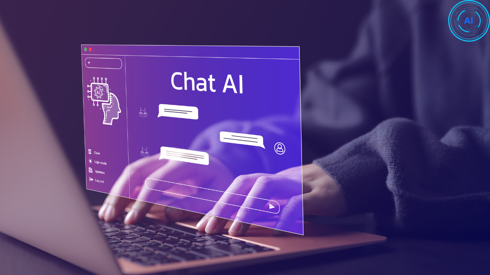

   
  
   

  

    
    
    
    
    
    
    
  

  <h3 align="center">NextGen AI - Generative AI Platform</h3>

  

    Using this NextGen AI SaaS application, we integrate all generative capabilities of AI into a single platform. We build an application using OpenAI API for generation of conversation, image, and code, while using Replicate API for music and video content generation. The platform also includes seamless integration of Stripe payment gateway, Crisp for customer support and help desk, Clerk API for user authentication system, and offers both free and pro plans.
  

## 📋 <a name="table">Table of Contents</a>

1. 🤖 [Introduction](#introduction)
2. ⚙️ [Tech Stack](#tech-stack)
3. 🔋 [Features](#features)

## 🚨 About

This project is a comprehensive SaaS web application that integrates various AI functionalities using OpenAI's API. Here is the demo of [NextGen AI](./demo.mp4).

## <a name="introduction">🤖 Introduction</a>

Using this NextGen AI SaaS application, we integrate all generative capabilities of AI into a single platform. We build an application using OpenAI API for generation of conversation, image, and code, while using Replicate API for music and video content generation. The platform also includes seamless integration of Stripe payment gateway, Crisp for customer support and help desk, Clerk API for user authentication system, and offers both free and pro plans.

## <a name="tech-stack">⚙️ Tech Stack</a>

- React.js
- Next.js
- TypeScript
- Tailwind CSS

## <a name="features">🔋 Features</a>

👉 **Modern User Interface**: A modern and user-friendly interface, offering an intuitive experience for users.

👉 **Generative AI Integration**: Utilize OpenAI's API to integrate advanced generative AI functionalities into your
